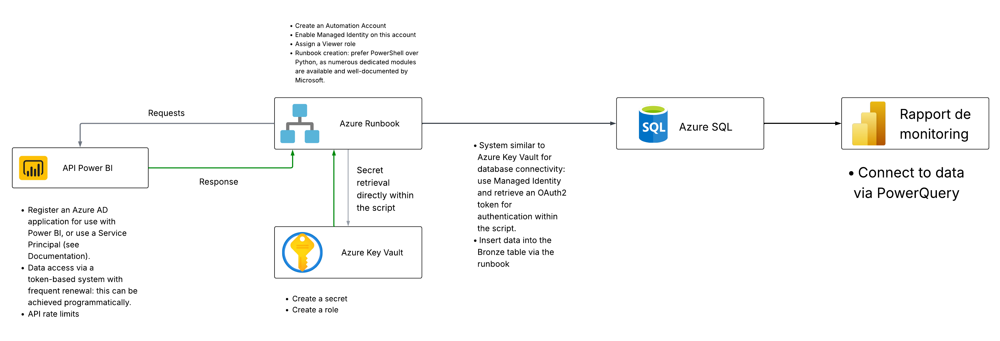
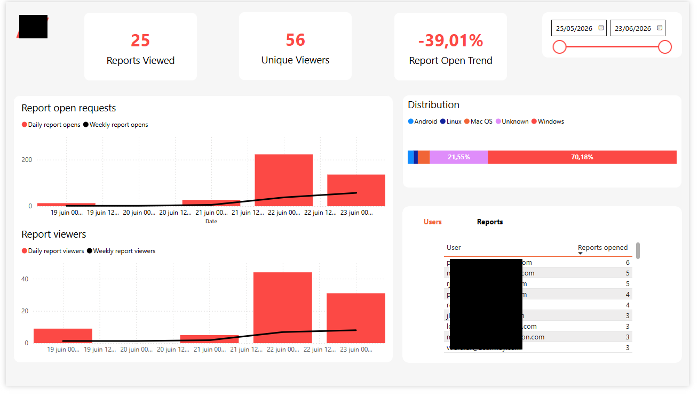
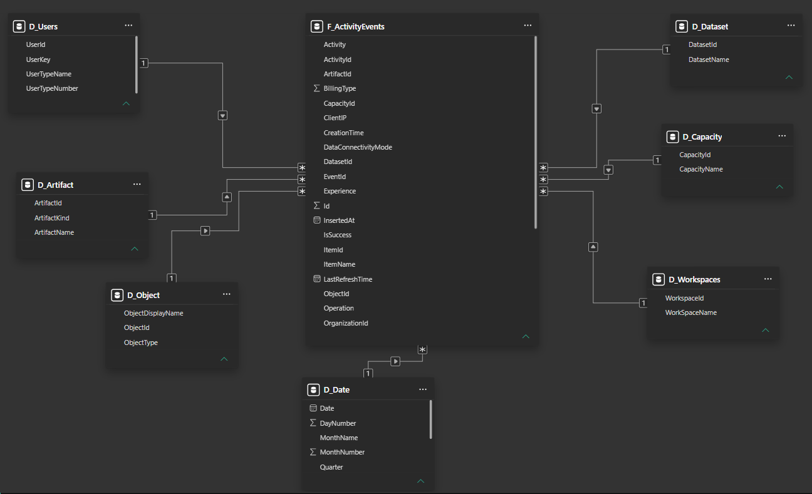

# Power BI Activity Monitoring

A Power BI monitoring solution built for a client, designed to track report usage, user activity, and adoption metrics across a Power BI tenant. The pipeline collects activity events from the Power BI Admin API, stores them in Azure SQL, and exposes them through an interactive Power BI report.




> ⚠️ **This project involves significant Azure administration prerequisites.** Many of the setup steps described below require elevated permissions on the Azure tenant (Entra ID, Azure Automation, Azure SQL, Key Vault). These must be coordinated with a tenant administrator before implementation.

***

## Architecture Overview

The pipeline follows a three-stage pattern:

```
Power BI Admin API → Azure Automation Runbook → Azure SQL (Bronze layer) → Power BI Report
```

1. **Power BI Admin API** exposes activity events (report views, refreshes, logins, etc.) via a REST endpoint.
2. **Azure Automation Runbook** (PowerShell) authenticates using a Service Principal, queries the API, and inserts data into Azure SQL.
3. **Azure SQL** stores raw activity events in a Bronze table (`ActivityEvents`).
4. **Power BI Report** connects to Azure SQL via PowerQuery and exposes KPIs through a semantic model.


***

## Azure Setup

### 1. App Registration (Azure AD / Entra ID)

Register an Azure AD application for use with Power BI, or use a Service Principal.

- The App Registration must be granted Power BI API permissions in Entra ID (e.g., `Tenant.Read.All` for activity events — requires admin consent).
- Data access is token-based with frequent renewal, achievable programmatically via the OAuth2 Client Credentials flow.
- Be aware of **Power BI Admin API rate limits** — the activity events endpoint allows a maximum time window of **24 hours per request** and returns up to **5,000 events per page** (pagination handled automatically by the script).

> 🔐 **Admin requirement:** Granting `Tenant.Read.All` requires a Power BI tenant administrator to approve the permission in Entra ID.

### 2. Azure Automation Account

- Create an **Automation Account** in Azure.
- Enable **Managed Identity** on this account.
- Assign a **Viewer role** at the appropriate scope (subscription or resource group).
- Create a **Runbook** using PowerShell — preferred over Python for this use case, as numerous dedicated modules are available and well-documented by Microsoft.

### 3. Secrets & Key Vault

- The Runbook retrieves secrets (Tenant ID, Client ID, Client Secret) directly from **Azure Key Vault** at runtime.
- Authentication to Key Vault uses the Automation Account's **Managed Identity** — no hardcoded credentials.
- Setup requires:
  - Creating a **secret** in Key Vault for the App Registration client secret.
  - Creating a **Key Vault access policy or role** granting the Managed Identity read access to secrets.

### 4. Azure SQL Database

- The Runbook connects to Azure SQL using an **OAuth2 token** retrieved via the Client Credentials flow (scope: `https://database.windows.net/.default`).
- The App Registration must be added as a database user with appropriate roles (`db_datawriter`, `db_datareader`).
- The Bronze table `ActivityEvents` is created automatically on first run (idempotent `IF NOT EXISTS` logic).

> 🔐 **Admin requirement:** Adding an Entra ID service principal as a SQL user requires a SQL administrator with Entra authentication enabled on the server.

***

## Runbook Script (`main.ps1`)

> ⚠️ The script is designed to be **copy-pasted into an Azure Automation Runbook**. It is **not intended to be executed directly in a local terminal** — it depends on the Automation Account's Managed Identity context and Azure Key Vault secret resolution, which are only available within the Azure Automation environment.

### Key Functions

| Function | Description |
|---|---|
| `GetPowerBiToken` | Retrieves an OAuth2 access token for the Power BI API via Client Credentials flow |
| `GetPowerBIActivityEvents` | Queries the Power BI Admin API with automatic pagination (`continuationUri` loop) |
| `Get-SqlToken` | Retrieves an OAuth2 token scoped to Azure SQL (`database.windows.net`) |
| `Invoke-SqlQuery` | Executes DDL/DML queries (CREATE, INSERT) against Azure SQL — uses `ExecuteNonQuery` |
| `Initialize-Database` | Creates the `ActivityEvents` Bronze table if it does not already exist (idempotent) |
| `WriteEventsToDatabase` | Bulk-inserts events using `SqlBulkCopy` — significantly more efficient than row-by-row INSERT for volumes above 100 rows |

### Null Handling

The script applies a consistent null-mapping strategy when building the in-memory `DataTable` before bulk insert:
- **String columns (`NVARCHAR`)**: use `if ($event.Field)` — null and empty strings are both treated as `DBNull`.
- **Numeric and boolean columns (`INT`, `BIT`)**: use `if ($null -ne $event.Field)` — prevents `0` and `$false` from being incorrectly treated as null.

### Scheduling

The Runbook is scheduled via Azure Automation to run daily. Since the Power BI Admin API enforces a **maximum 24-hour window per request**, the script dynamically calculates the start and end datetime based on the last successfully inserted record in the SQL table, ensuring no gaps and no duplicates.

***

## Semantic Model

The Power BI semantic model follows a **star schema** with one central fact table and six dimension tables.



### Tables

| Table | Type | Description |
|---|---|---|
| `F_ActivityEvents` | Fact | Raw activity events from the Power BI Admin API. Central table of the model. |
| `D_Date` | Dimension | Calendar table generated via `CALENDARAUTO()` with year, month, week, and weekday columns |
| `D_Users` | Dimension | Distinct users extracted from activity events (`UserId`, `UserKey`, `UserTypeName`) |
| `D_Artifact` | Dimension | Power BI artifacts referenced in events (`ArtifactId`, `ArtifactKind`, `ArtifactName`) |
| `D_Dataset` | Dimension | Datasets referenced in activity events |
| `D_Workspaces` | Dimension | Workspaces associated with activity events |
| `D_Capacity` | Dimension | Capacity information associated with activity events |
| `D_Object` | Dimension | Objects referenced in events (`ObjectId`, `ObjectType`, `ObjectDisplayName`) |

### Key Measures

| Measure | Description |
|---|---|
| `Total Views` | Total number of `ViewReport` activity events in the selected period |
| `Nb Reports Reached` | Count of distinct reports (`ArtifactId`) opened in the selected period |
| `Unique Viewers` | Count of distinct users who opened at least one report |
| `Report Open Trend Daily %` | Percentage change between the last day and the previous day within the selected date range |
| `Report Open Trend Previous Period` | Total views for the month preceding the start of the slicer range |
| `Report Open Trend %` | Percentage change between the current period and the previous period |
| `Rang Reports per User` | Dynamic ranking of users by number of reports opened (`RANKX` with `ALLSELECTED`) |

### PowerQuery Transformations

The following transformations are applied in PowerQuery before the data reaches the semantic model:

- `CreationTime` and `LastRefreshTime` extracted to `date` type (time component removed)
- `OS` column derived from `UserAgent` via conditional logic (Windows, macOS, iOS, Android, Linux — falls back to raw `UserAgent` if unrecognized, replaced with `"Unknown"` if null)
- Null values in key columns replaced with `"Unknown"` via `Table.ReplaceValue`

***

## Report Overview

The monitoring report exposes the following visuals:

- **KPI Cards** — Total views, unique viewers, and report open trend (daily or period-based)
- **Report Open Requests** — Daily bar chart with weekly moving average line
- **Report Viewers** — Daily unique viewer count with weekly trend
- **OS Distribution** — Stacked bar chart showing the breakdown of report opens by operating system
- **User Ranking / Report Ranking** — Switchable table (via bookmarks) showing top users by reports opened or top reports by view count

The date range is controlled by a **between-style date slicer** connected to `D_Date[Date]`, which propagates to all measures via the model relationships.

***

## Prerequisites Summary

| Requirement | Who needs to action it |
|---|---|
| App Registration in Entra ID | Azure / Entra Administrator |
| Power BI API permissions (admin consent) | Power BI Tenant Administrator |
| Azure Automation Account creation | Azure Administrator |
| Key Vault secret + access policy | Azure Administrator |
| Azure SQL server with Entra auth enabled | SQL / Azure Administrator |
| App Registration added as SQL user | SQL Administrator |
| Power BI Workspace access for the report | Power BI Administrator |